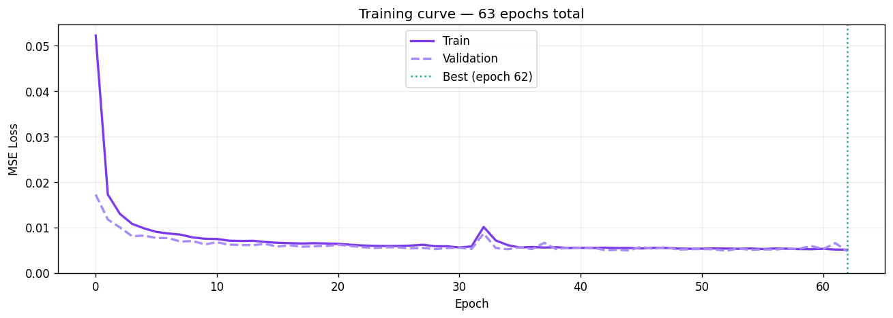

# 🎹 Adaptive Soundtrack AI



A Generative AI model that generates genre-controlled piano rolls (music) from pure noise using a **Conditional Denoising Diffusion Probabilistic Model (DDPM)**. 

Trained on the LPD-5 (Lakh Pianoroll Dataset) cleansed subset for 120+ epochs, achieving a final validation loss of **0.0048**.

## 🚀 Features
- **Genre Conditioning:** Capable of generating music tailored to 4 specific genres: `Pop_Rock`, `Electronic`, `Rap`, and `Jazz`.
- **Classifier-Free Guidance (CFG):** Allows tuning the strength of the genre conditioning during inference.
- **Fast Sampling:** Uses DDIM (Denoising Diffusion Implicit Models) to generate samples in just 50 steps instead of the full 1000 diffusion steps.
- **Interactive UI:** Built-in Streamlit app for real-time music generation and MIDI export.

## 🧠 Architecture
- **Input:** Pure Gaussian noise `(B, 1, 64, 88)` representing 4 bars of 16th notes across 88 piano keys.
- **Backbone:** U-Net architecture with residual blocks and attention mechanisms.
- **Conditioning:** Genre labels are passed through a learned embedding, added to the sinusoidal timestep embedding, and injected into the U-Net via FiLM (Feature-wise Linear Modulation).
- **Output:** Binarized piano roll converted to standard `.mid` format.

## 📊 Quantitative Results (Epoch 62)

| Genre      | Pitch Entropy | Note Density | Pitch Range Used | Scale Consistency |
|------------|---------------|--------------|------------------|-------------------|
| Pop_Rock   | 3.972         | 0.0378       | 54.5             | 0.536             |
| Electronic | 4.120         | 0.0535       | 54.0             | 0.678             |
| Rap        | 3.700         | 0.0397       | 45.2             | 0.560             |
| Jazz       | 4.190         | 0.0619       | 52.0             | 0.617             |

## 💻 Local Setup & Inference

1. **Install dependencies:**
   ```bash
   pip install -r requirements.txt
   ```

2. **Run the Streamlit App:**
   ```bash
   streamlit run app.py
   ```
3. Open `http://localhost:8501` in your browser.
4. Select a genre, adjust CFG scale and DDIM steps, and click **Generate**.
5. Download the output as a `.mid` file and open it in any DAW (Ableton, FL Studio, GarageBand) or online MIDI player to hear the music!

## 📁 Repository Structure
- `app.py`: Streamlit inference UI.
- `src/`: Core model code (`unet.py`, `ddpm.py`, `trainer.py`, `dataset.py`).
- `notebooks/`: Kaggle notebooks for data processing and training.
- `configs/`: Hyperparameters and paths.
- `plots/` & `outputs/`: Training metrics and generated examples.
- `checkpoints/`: Model weights (`checkpoint_best.pt` required for inference).
